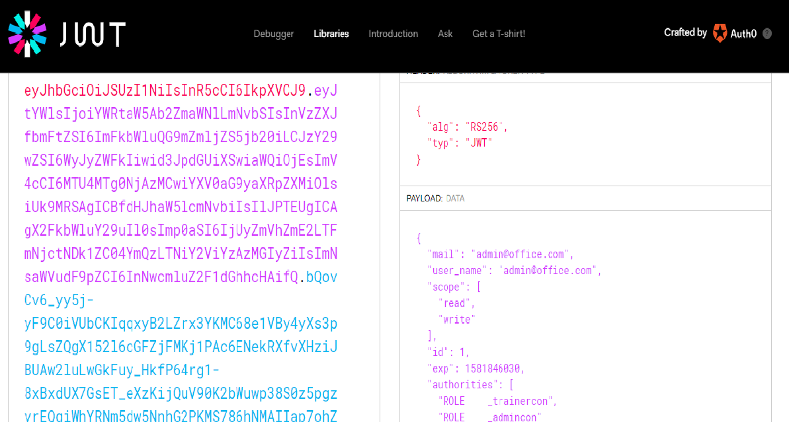

# SpringSecurity-AuthServer

This springboot project tries to simulate spring security using *oauth2.o* and jwt token enhancer. This works along with the other project SpringSecurity-Resource server. Among the many implementation alternartives for oauth2.o, this project implements security with client credentials and user credentials.In order to get wide overview of all implementation please refer through this link. The scope of this project comes in microservice environment.As we are using jwt tokens for the prupose of exchanging, there is no need to save the token in database. We use *RS256 alogirthm* for jwt token encryption and decrption.

## Pre-Requirements
Here we use mysql database to store client credentials and user details. create following table to store client details.

```
  create table oauth_client_details (
    client_id VARCHAR(256) PRIMARY KEY,
    resource_ids VARCHAR(256),
    client_secret VARCHAR(256),
    scope VARCHAR(256),
    authorized_grant_types VARCHAR(256),
    web_server_redirect_uri VARCHAR(256),
    authorities VARCHAR(256),
    access_token_validity INTEGER,
    refresh_token_validity INTEGER,
    additional_information VARCHAR(4096),
    autoapprove VARCHAR(256)
);
```

```
INSERT INTO `oauth_client_details` (`client_id`, `resource_ids`, `client_secret`, `scope`, `authorized_grant_types`, `web_server_redirect_uri`, `authorities`, `access_token_validity`, `refresh_token_validity`, `additional_information`, `autoapprove`) VALUES ('springauthapp', NULL, '123456', 'read,write', 'password,refresh_token', NULL, NULL, '3600', '180000', NULL, NULL);
```

## Work flow steps
1. Fill client details for login request
  

2. Add user credentials for login request with
   2.1 granttype-password
      
  
   2.2 granttype-refresh_token
      
      
3. Login Response
    
    
4. Decoded jwt access token
    
    


